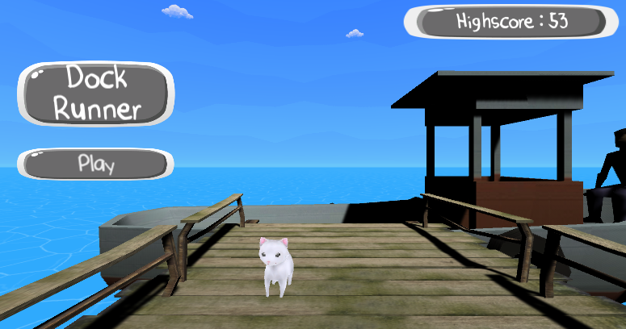
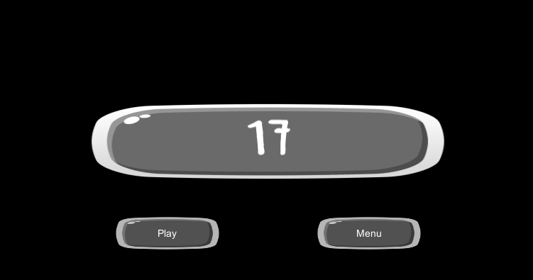

# Cat-Runner
Cat runner for Video game design at LSU

Used free assets from Unity Asset Store to create an endless runner game. 

Game features basic animations, player collision, water, sky, high score management, and lots of running.

## Objective
You are a small white cat who must make it to their owner on this endless dock runner! Earn points for how far you can run. Make sure you dodge the boxes on the way with your arrow keys or else you'll be late!

## Menu

## Running

## End Screen

Executable version located [here](https://github.com/MaeKat/CatRunnerEXE) with instructions.
